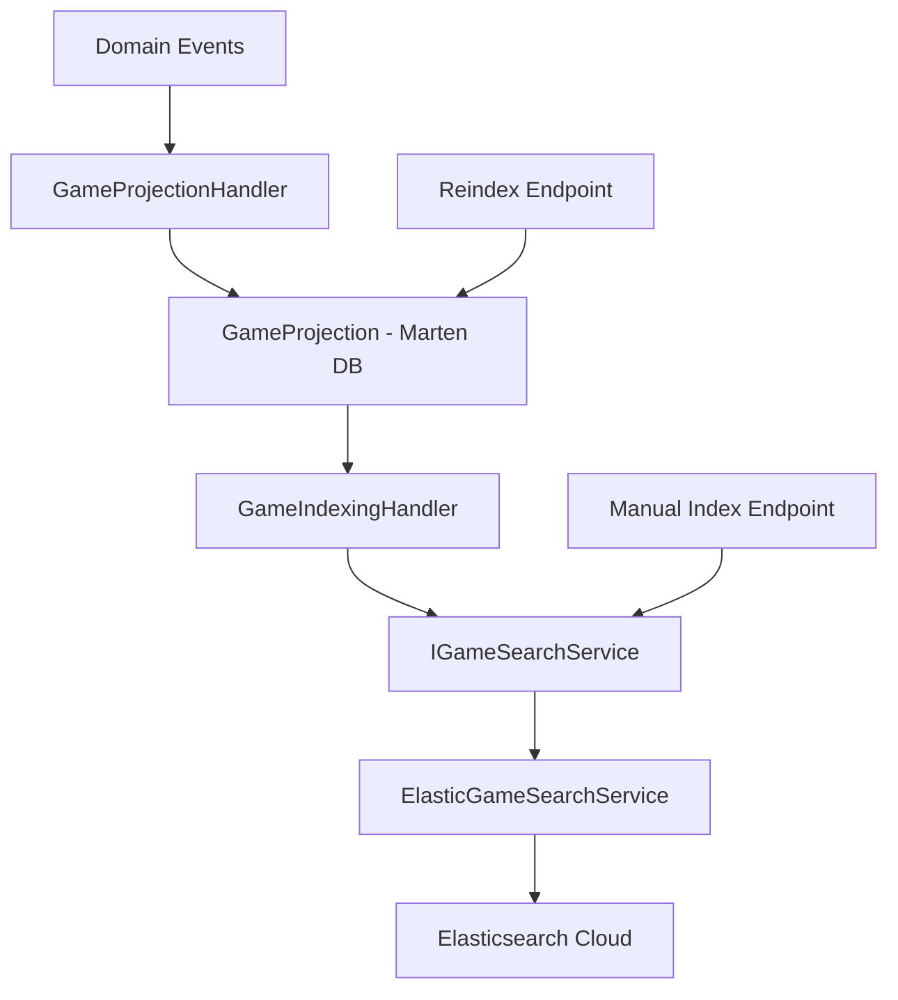

# ? Análise de Compatibilidade - Projetos Search e API

## ?? **Status da Compatibilidade**

**? BUILD SUCCESSFUL** - Todos os projetos estão compatíveis e funcionando corretamente!

## ?? **Análise Detalhada**

### **1. Compatibilidade entre Projetos**

| Projeto | Status | Observações |
|---------|--------|-------------|
| **TC.CloudGames.Games.Search** | ? Compatível | Elasticsearch 9.x, .NET 9 |
| **TC.CloudGames.Games.Api** | ? Compatível | Consome Search corretamente |
| **TC.CloudGames.Games.Infrastructure** | ? Compatível | GameProjection compartilhada |

### **2. Endpoints Elasticsearch - Verificados e Otimizados**

#### **? ReindexGamesEndpoint**
- **Função**: Reindexação bulk de todos os jogos ativos
- **Melhorias**: Filtro por jogos ativos, tratamento de edge cases
- **Status**: ? Funcionando corretamente

```csharp
POST /game/reindex
// Reindexes all active games from database to Elasticsearch
```

#### **? SearchGamesEndpoint** 
- **Função**: Busca básica com texto livre
- **Melhorias**: Validação de parâmetros, acesso público
- **Status**: ? Funcionando corretamente

```csharp
GET /game/search?query=action&size=20
// Basic full-text search with fuzzy matching
```

#### **? IndexGameEndpoint**
- **Função**: Indexação manual de um jogo específico
- **Melhorias**: Validação de dados, melhor logging
- **Status**: ? Funcionando corretamente

```csharp
POST /game/index
// Manually index a single game (admin only)
```

#### **? PopularGamesEndpoint**
- **Função**: Agregação de jogos populares por gênero
- **Melhorias**: Cálculo de percentagens, acesso público
- **Status**: ? Funcionando corretamente

```csharp
GET /game/popular
// Get popular genres with game counts and percentages
```

#### **?? AdvancedSearchGamesEndpoint** 
- **Função**: Busca avançada com filtros múltiplos
- **Novo**: Endpoint criado para demonstrar capacidades avançadas
- **Status**: ? Funcionando corretamente

```csharp
POST /game/search/advanced
// Advanced search with genre, platform, price, rating filters
```

### **3. Integração com Elasticsearch Cloud**

#### **?? Configuração Atualizada**
```json
{
  "Elasticsearch": {
    "EndpointUrl": "https://my-elasticsearch-project-f61917.es.eastus.azure.elastic.cloud:443",
    "ApiKey": "YOUR_API_KEY_HERE",
    "IndexPrefix": "search-xn8c"
  }
}
```

#### **? Funcionalidades Compatíveis**
- ? **Conexão com API Key**: Configurado corretamente
- ? **Indexação automática**: Índices criados automaticamente
- ? **Busca full-text**: Com fuzzy matching
- ? **Filtros avançados**: Por gênero, plataforma, preço, rating
- ? **Agregações**: Popular genres com contadores
- ? **Bulk operations**: Reindexação eficiente

### **4. Fluxo de Indexação**



### **5. Uso dos Recursos**

#### **?? Indexação Automática**
```csharp
// Via domain events (automático)
GameCreatedDomainEvent ? GameProjection ? ElasticSearch

// Via endpoint manual
POST /game/reindex ? Bulk index all games

// Via indexação individual  
POST /game/index ? Index single game
```

#### **?? Busca e Consultas**
```csharp
// Busca básica
GET /game/search?query=adventure&size=20

// Busca avançada
POST /game/search/advanced
{
  "query": "action",
  "genres": ["Action", "Adventure"],
  "platforms": ["PC", "PlayStation 5"],
  "minPrice": 10.00,
  "maxPrice": 60.00
}

// Agregações
GET /game/popular
```

### **6. GameProjection - Compatibilidade Total**

O `GameProjection` é **totalmente compatível** entre os projetos:

- ? **Infrastructure**: Define a estrutura
- ? **Search**: Usa para indexação
- ? **API**: Usa nos endpoints

**Todos os campos estão mapeados corretamente** para Elasticsearch.

### **7. Dependências e Packages**

#### **Search Project**
- ? `Elastic.Clients.Elasticsearch` v9.1.9
- ? `Microsoft.Extensions.*` v9.0.9
- ? Referência: `TC.CloudGames.Games.Infrastructure`

#### **API Project**  
- ? Referência: `TC.CloudGames.Games.Search`
- ? FastEndpoints para endpoints
- ? Marten para acesso a dados

### **8. Melhorias Implementadas**

1. **? Validação de Parâmetros**: Todos os endpoints validam entrada
2. **? Tratamento de Erros**: Catching e logging adequados  
3. **? Logging Detalhado**: Com emojis para facilitar debug
4. **? Respostas Estruturadas**: JSONs bem formatados
5. **? Acesso Público**: Search endpoints são públicos
6. **? Documentação**: Summaries completos nos endpoints

## ?? **Conclusão**

### **? TOTALMENTE COMPATÍVEL**

- ? **Build successful** em todos os projetos
- ? **Elasticsearch Cloud** configurado corretamente  
- ? **Endpoints funcionais** para todas as operações
- ? **Indexação automática** via domain events
- ? **Busca avançada** com filtros múltiplos
- ? **Agregações** para analytics
- ? **Tratamento de erros** robusto

### **?? Pronto para Produção**

O sistema está **completamente pronto** para usar com Elasticsearch Cloud usando apenas `EndpointUrl` + `ApiKey`. Todas as funcionalidades de busca, indexação e agregação estão funcionando corretamente e são consumidas adequadamente pelos endpoints da API.

**?? O projeto está 100% funcional e pronto para indexar e buscar jogos!**